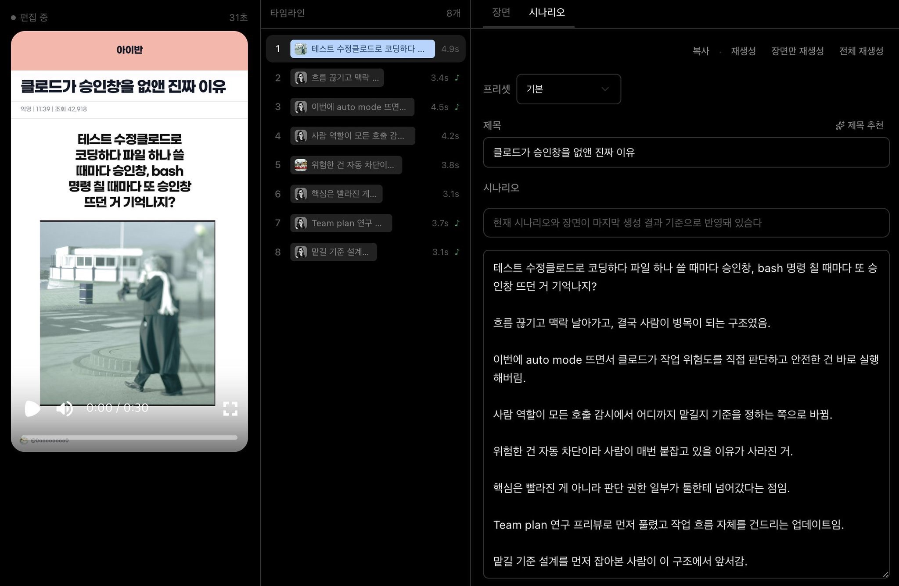
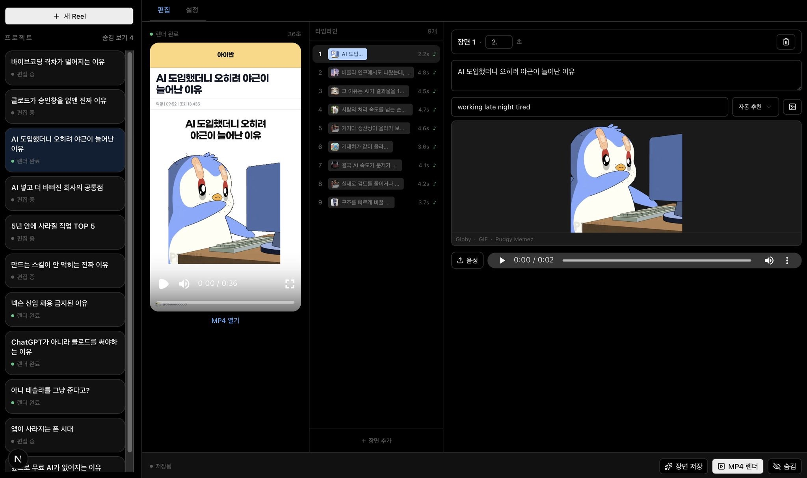
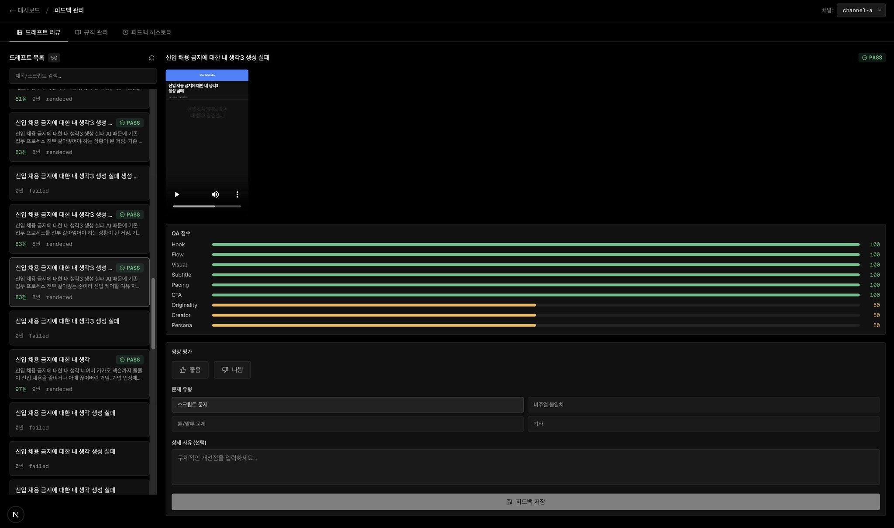
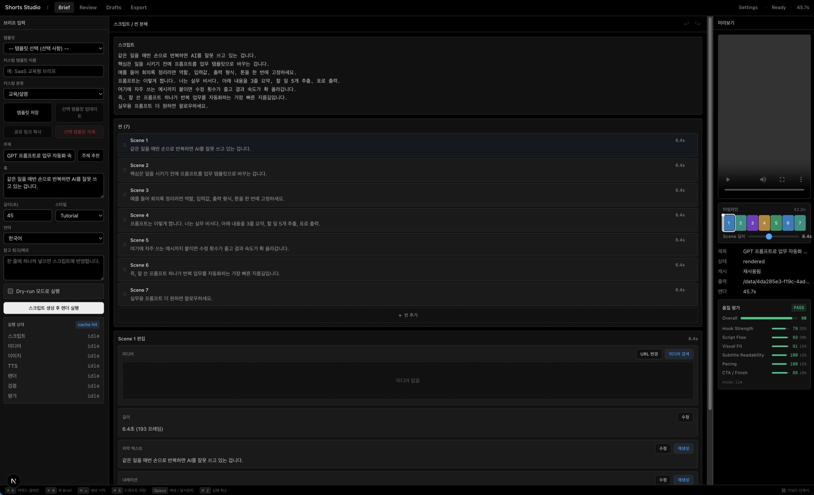

# Card Short Maker

Meta description: 카드형 숏폼 영상을 local-first로 설계하고, QA하고, MP4까지 만드는 오픈소스 도구.

Tags: `shorts`, `video-automation`, `ffmpeg`, `tts`, `react`, `typescript`, `local-first`, `22B Labs`

숏폼 제작의 진짜 병목은 편집 자체보다 판단입니다.  
Card Short Maker는 그 판단을 `Brief -> Scene -> QA -> Render`라는 고정된 문법으로 바꾸기 위해 만든 오픈소스 프로젝트입니다.

The real bottleneck in short-form production is not editing itself.  
Card Short Maker is an open-source project that turns those decisions into a fixed grammar: `Brief -> Scene -> QA -> Render`.

## Why / 왜 존재하나

한국어:

- 무엇을 먼저 말할지
- 몇 초로 나눌지
- 어떤 장면으로 보일지
- 자막과 음성을 어떻게 붙일지

이 판단을 사람이 매번 처음부터 다시 하면 비용이 커지고 품질이 흔들립니다.  
그래서 이 프로젝트는 “더 화려한 편집기”보다 “같은 기준으로 계속 만들 수 있는 제작 문법”을 우선합니다.

English:

- what to say first
- how many seconds each idea should take
- what visual each scene should map to
- how subtitles and narration should be attached

If humans restart those decisions from scratch every time, cost rises and quality drifts.  
This project prioritizes a repeatable production grammar over a flashy editor.

## What It Does / 지금 되는 것

한국어:

- 브리프 입력
- 자동 장면 분해
- 씬별 자막/미디어 쿼리/QA 생성
- 장면 추가, 복제, 삭제, 순서 이동
- 프로젝트 JSON import/export
- render package 생성
- 로컬 TTS 기반 음성 생성
- FFmpeg 기반 카드형 MP4 렌더 CLI

English:

- brief input
- automatic scene decomposition
- scene-level subtitles, media queries, and QA
- add, duplicate, delete, and reorder scenes
- project JSON import/export
- render package generation
- local TTS-based narration
- FFmpeg-based card-style MP4 rendering through CLI

## Screenshots / 화면 예시






## Execution Modes / 실행 모드

무료 공개배포 기준으로 기본값은 `local`입니다.

The default mode for free public distribution is `local`.

| Mode | 한국어 | English |
| --- | --- | --- |
| `local` | 기본값. 로컬 규칙 엔진, 로컬 TTS, 번들/시스템 FFmpeg를 우선 사용합니다. | Default. Uses local rules, local TTS, and bundled/system FFmpeg first. |
| `byo-api` | 사용자가 자기 API 키를 넣어 스크립트/QA/TTS를 돌립니다. | Users bring their own API key for script/QA/TTS. |
| `hybrid` | 로컬 우선이지만 필요한 부분만 외부 API를 섞습니다. | Local-first with optional API fallback where needed. |

중요한 점은 선택지가 아니라 계약입니다.  
세 모드는 모두 같은 프로젝트 구조와 같은 파이프라인을 공유합니다.

The important thing is not the choice itself, but the contract.  
All three modes share the same project structure and the same pipeline.

## Quick Start / 빠른 시작

더 자세한 단계별 설명은 [docs/GETTING_STARTED.md](docs/GETTING_STARTED.md)에 있습니다.  
For a more detailed step-by-step guide, see [docs/GETTING_STARTED.md](docs/GETTING_STARTED.md).

### 1. Clone / 클론

```bash
git clone https://github.com/sinmb79/Card-Short-Maker.git
cd Card-Short-Maker
```

### 2. Install / 설치

```bash
npm install
```

### 3. Run the studio UI / 스튜디오 실행

```bash
npm run dev
```

브라우저에서 Vite가 보여주는 주소를 열면 됩니다.  
Open the URL printed by Vite in your browser.

### 4. Build / 빌드

```bash
npm run build
```

## Requirements / 요구사항

한국어:

- Node.js 20 이상 권장
- Windows 11 권장
- FFmpeg는 프로젝트 의존성으로 함께 내려받습니다
- 한국어 로컬 TTS를 쓰려면 Windows 기본 음성 `Microsoft Heami Desktop` 권장

English:

- Node.js 20+ recommended
- Windows 11 recommended
- FFmpeg is downloaded as a project dependency
- For Korean local TTS, the Windows voice `Microsoft Heami Desktop` is recommended

참고:

- 이 저장소는 현재 Windows 로컬 워크플로를 가장 잘 지원합니다.
- 기본 렌더는 번들된 `ffmpeg-static`을 우선 사용합니다.
- 필요하면 `render` 명령에서 `--ffmpeg`로 직접 경로를 줄 수 있습니다.

Notes:

- The current repo is optimized for Windows local workflows.
- The default renderer uses bundled `ffmpeg-static`.
- If needed, you can still pass a custom path with `--ffmpeg`.

## CLI / 명령행 사용법

도움말:

```bash
npm run cli -- help
```

Generate project JSON / 프로젝트 생성:

```bash
npm run cli -- generate --brief ./examples/sample-brief.json --out ./examples/generated-project.json
```

Generate with a specific mode / 실행 모드 지정:

```bash
npm run cli -- generate --brief ./examples/sample-brief.json --mode local --out ./examples/generated-project.json
```

QA review / QA 확인:

```bash
npm run cli -- qa --project ./examples/generated-project.json
```

Create render package / 렌더 패키지 생성:

```bash
npm run cli -- package --project ./examples/generated-project.json --out ./examples/render-pack
```

Render MP4 / MP4 렌더:

```bash
npm run cli -- render --project ./examples/generated-project.json --out ./examples/render-output
```

If FFmpeg is not on PATH / FFmpeg 경로를 직접 줄 때:

```bash
npm run cli -- render --project ./examples/generated-project.json --ffmpeg C:\ffmpeg\bin\ffmpeg.exe
```

Render without local TTS / 로컬 TTS 없이 렌더:

```bash
npm run cli -- render --project ./examples/generated-project.json --no-tts
```

Project metrics / 프로젝트 메트릭:

```bash
npm run cli -- metrics --project ./examples/generated-project.json
npm run cli -- metrics --project ./examples/generated-project.json --json
```

Doctor (validation) / 검증 실행:

```bash
npm run cli -- doctor --project ./examples/generated-project.json
# CI 친화 종료 코드 — 실패 시 1
npm run cli -- doctor --project ./examples/generated-project.json --json
```

## Project File / 프로젝트 파일 구조

핵심은 자유 텍스트가 아니라 객체 계약입니다.

The core is not free-form text, but structured contracts.

```ts
type Brief = {
  title: string;
  topic: string;
  intent: "info" | "opinion" | "story";
  tone: "neutral" | "serious" | "energetic" | "urgent";
  targetDuration: number;
  platform: "youtube" | "tiktok" | "reels";
  language: "ko" | "en";
};
```

```ts
type Scene = {
  id: string;
  text: string;
  duration: number;
  role: "hook" | "build" | "payoff" | "cta";
};
```

## Render Package / 렌더 패키지

`package` 명령은 아래 파일을 만듭니다.

The `package` command creates the files below.

- `project.json`: 전체 편집 상태 / full editable project state
- `render-manifest.json`: 렌더용 장면 계약 / renderer-facing scene contract
- `subtitles.srt`: SRT 자막 타임라인 / SRT subtitle timeline
- `subtitles.vtt`: WebVTT (HTML5 / 웹 플레이어) / WebVTT for HTML5 players
- `subtitles.ass`: ASS / SubStation Alpha (고급 스타일링) / ASS for advanced styling
- `ffmpeg-concat.txt`: FFmpeg concat 템플릿 / FFmpeg concat template
- `README.txt`: 패키지 메모 / package notes

## Repository Layout / 저장소 구조

- [src/App.tsx](src/App.tsx): main studio shell
- [src/components/StudioPanels.tsx](src/components/StudioPanels.tsx): workspace panels
- [src/lib/pipeline.ts](src/lib/pipeline.ts): brief-to-scene-to-QA pipeline
- [src/lib/render-engine.ts](src/lib/render-engine.ts): local MP4 render engine
- [src/lib/local-tts.ts](src/lib/local-tts.ts): Windows local TTS bridge
- [src/lib/project-io.ts](src/lib/project-io.ts): JSON import normalization
- [src/lib/render-package.ts](src/lib/render-package.ts): render package generation
- [src/cli.ts](src/cli.ts): CLI entrypoint
- [docs/architecture.md](docs/architecture.md): architecture note

## Validation / 검증

```bash
npm run test
npm run check
npm run build
```

## Current Scope / 현재 범위

완성된 것:

- 편집 UI
- CLI
- 프로젝트 JSON
- local-first 실행 모드
- 로컬 TTS 연동
- FFmpeg 기반 카드형 렌더 CLI

Finished:

- editing UI
- CLI
- project JSON
- local-first execution modes
- local TTS integration
- FFmpeg-based card-style render CLI

아직 남은 것:

- 실제 미디어 검색 API 연동
- 고급 템플릿/테마 시스템
- 멀티플랫폼별 출력 프리셋
- 설치형 데스크톱 패키징

Still remaining:

- real media search integration
- advanced template/theme system
- platform-specific export presets
- packaged desktop distribution

## Philosophy / 철학

이 프로젝트는 영상을 자동 생성하는 장난감보다,  
좋은 숏폼의 기준을 코드로 고정하는 시도에 가깝습니다.

This project is less about making a flashy auto-video toy,  
and more about fixing the criteria of a good short-form video in code.

도구는 사라져도 문법은 남습니다.  
Tools disappear. Grammar stays.
